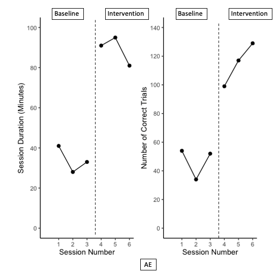
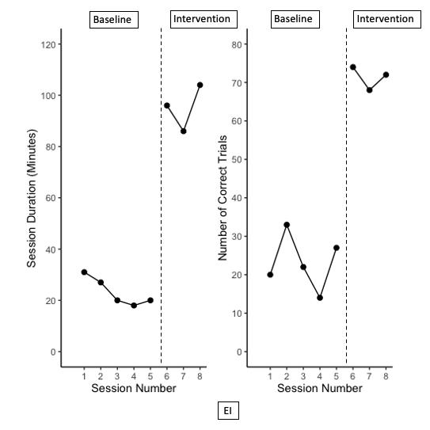
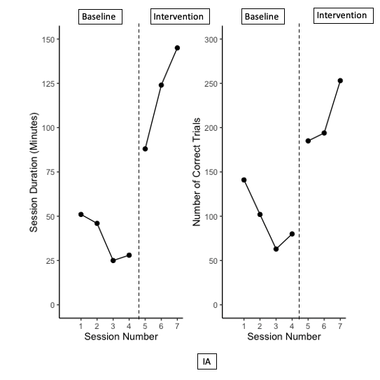

````{r setup, include=FALSE}
knitr::opts_chunk$set(echo = FALSE, warning = FALSE, message = FALSE)
```

```{r setup 1, include=FALSE}
library(tidyverse)
library(rio)
library(here)
library(gghighlight)
library(forcats)
library(ggrepel)
library(gt)
library(knitr)
library(kableExtra)
library(reactable)
library(plotly)
library(SCVA)
library(patchwork)
library(colorblindr)
library(scan)

theme_set(theme_minimal(15) +
            theme(legend.position = "bottom",
                  panel.grid.major.x = element_line(color = "gray60"),
                  panel.grid.minor.x = element_blank(),
                  panel.grid.major.y = element_blank())
          )

saje <- import(here("data", "SAJE_status_goal.xlsx"),
               setclass = "tbl_df") 

giad <- import(here("data", "GIAD_status_goal.xlsx"),
               setclass = "tbl_df") 

leli <- import(here("data", "LELI_status_goal.xlsx"),
               setclass = "tbl_df") 
 
```

The purpose of this page is to explore the relationship between session duration and the number of accurate trials completed during the session. Taken together, these variables can represent client endurance, where a linear relationship is hypothesized, insofar session duration was expected to increase as the number of accurate trials per session increased. 

## Patchwork Plots

This first series of plots use the `patchwork` package to combine two plots into one image. Plots displayed on the left side of the images represent the change in session duration between the baseline and intervention phases, and the plots on the right side of the images display the change in the number of corret trials obtained per session across the baseline and intervention phases. 

### SAJE

```{r, include=FALSE}
names(saje)

saje_duration <- ggplot() +
  geom_line(data = saje, aes(x = session, y = bl_duration)) +
  geom_point(data = saje, aes(x = session, y = bl_duration), size = 2) +
  geom_line(data = saje, aes(x = session, y = tx_duration)) +
  geom_point(data = saje, aes(x = session, y = tx_duration), size = 2) +
  scale_x_continuous(limits = c(0, 6),
                     breaks = c(1, 2, 3, 4, 5, 6)) +
  scale_y_continuous(limits = c(0, 100),
                     breaks = c(0, 20, 40, 60, 80, 100)) +
  theme_classic() +
  labs(x = "Session Number",
       y = "Session Duration (Minutes)") 


saje_accuracy <- ggplot() +
  geom_line(data = saje, aes(x = session, y = bl_correct)) +
  geom_point(data = saje, aes(x = session, y = bl_correct), size = 2) +
  geom_line(data = saje, aes(x = session, y = tx_correct)) +
  geom_point(data = saje, aes(x = session, y = tx_correct), size = 2) +
  scale_x_continuous(limits = c(0, 6),
                     breaks = c(1, 2, 3, 4, 5, 6)) +
  scale_y_continuous(limits = c(0, 140),
                     breaks = c(0, 20, 40, 60, 80, 100, 120, 140)) +
  theme_classic() +
  labs(x = "Session Number",
       y = "Number of Correct Trials") 

```

```{r, include=FALSE}
saje_combined <- saje_duration + saje_accuracy
```

{width=75%}


### LELI

```{r, include=FALSE}
leli_duration <- ggplot() +
  geom_line(data = leli, aes(x = session, y = bl_duration)) +
  geom_point(data = leli, aes(x = session, y = bl_duration), size = 2) +
  geom_line(data = leli, aes(x = session, y = tx_duration)) +
  geom_point(data = leli, aes(x = session, y = tx_duration), size = 2) +
  scale_x_continuous(limits = c(0, 8),
                     breaks = c(1, 2, 3, 4, 5, 6, 7, 8)) +
  scale_y_continuous(limits = c(0, 120),
                     breaks = c(0, 20, 40, 60, 80, 100, 120)) +
  theme_classic() +
  labs(x = "Session Number",
       y = "Session Duration (Minutes)") 


leli_accuracy <- ggplot() +
  geom_line(data = leli, aes(x = session, y = bl_correct)) +
  geom_point(data = leli, aes(x = session, y = bl_correct), size = 2) +
  geom_line(data = leli, aes(x = session, y = tx_correct)) +
  geom_point(data = leli, aes(x = session, y = tx_correct), size = 2) +
  scale_x_continuous(limits = c(0, 8),
                     breaks = c(1, 2, 3, 4, 5, 6, 7, 8)) +
  scale_y_continuous(limits = c(0, 80),
                     breaks = c(0, 10, 20, 30, 40, 50, 60, 70, 80)) +
  theme_classic() +
  labs(x = "Session Number",
       y = "Number of Correct Trials") 

```

```{r, include=FALSE}
leli_combined <- leli_duration + leli_accuracy
```

{width=75%}


### GIAD

```{r, include=FALSE}
giad_duration <- ggplot() +
  geom_line(data = giad, aes(x = session, y = bl_duration)) +
  geom_point(data = giad, aes(x = session, y = bl_duration), size = 2) +
  geom_line(data = giad, aes(x = session, y = tx_duration)) +
  geom_point(data = giad, aes(x = session, y = tx_duration), size = 2) +
  scale_x_continuous(limits = c(0, 7),
                     breaks = c(1, 2, 3, 4, 5, 6, 7)) +
  scale_y_continuous(limits = c(0, 150),
                     breaks = c(0, 25, 50, 75, 100, 125, 150)) +
  theme_classic() +
  labs(x = "Session Number",
       y = "Session Duration (Minutes)") 


giad_accuracy <- ggplot() +
  geom_line(data = giad, aes(x = session, y = bl_correct)) +
  geom_point(data = giad, aes(x = session, y = bl_correct), size = 2) +
  geom_line(data = giad, aes(x = session, y = tx_correct)) +
  geom_point(data = giad, aes(x = session, y = tx_correct), size = 2) +
  scale_x_continuous(limits = c(0, 7),
                     breaks = c(1, 2, 3, 4, 5, 6, 7)) +
  scale_y_continuous(limits = c(0, 300),
                     breaks = c(0, 50, 100, 150, 200, 250, 300)) +
  theme_classic() +
  labs(x = "Session Number",
       y = "Number of Correct Trials") 

```

```{r, include=FALSE}
giad_combined <- giad_duration + giad_accuracy
```

{width=75%}


## Endurance and Accuracy Relationship Plots

These scatter plots display the linear relationship between session duration and the number of correct trials observed per session. These plots appear to be a good representation of treatment endurance. The number of correct trials is outlined as the x-axis and can be interpreted as a strong predictor of session duration (minutes), suggesting that session duration was dependent upon the number of correct trials the participant obtained per session.

### SAJE

```{r, include=FALSE}
names(saje)

saje_scatter <- ggplot(saje, aes(all_duration, all_correct)) +
  geom_point(size = 2) +
  geom_vline(xintercept = 60,
             linetype = "dashed",
             color = "black",
             size = 1) +
  geom_text_repel(aes(label = session),
                  size = 4) +
  scale_x_continuous(limits = c(0, 100),
                     breaks = c(0, 20, 40, 60, 80, 100)) +
  scale_y_continuous(limits = c(0, 140),
                     breaks = c(0, 20, 40, 60, 80, 100, 120, 140)) +
  theme_classic() +
  labs(x = "Session Duration",
       y = "Number of Correct Trials per Session",
       caption = "Text labels indicate session number")

saje_scatter2 <- ggplot(saje, aes(all_correct, all_duration)) +
  geom_point(size = 2) +
  geom_vline(xintercept = 75,
             linetype = "dashed",
             color = "black",
             size = 1) +
  geom_text_repel(aes(label = session),
                  size = 4) +
  scale_x_continuous(limits = c(0, 140),
                     breaks = c(0, 20, 40, 60, 80, 100, 120, 140)) +
  scale_y_continuous(limits = c(0, 100),
                     breaks = c(0, 20, 40, 60, 80, 100)) +
  theme_classic() +
  labs(x = "Number of Correct Trials per Session",
       y = "Session Duration (Minutes)",
       caption = "Text labels indicate session number")

```

```{r, include=TRUE}
saje_scatter2
```


### LELI

```{r, include=FALSE}
leli_scatter <- ggplot(leli, aes(all_duration, all_correct)) +
  geom_point(size = 2) +
  geom_vline(xintercept = 47.5,
             linetype = "dashed",
             color = "black",
             size = 1) +
  geom_text_repel(aes(label = session),
                  size = 4) +
  scale_x_continuous(limits = c(0, 120),
                     breaks = c(0, 20, 40, 60, 80, 100, 120)) +
  scale_y_continuous(limits = c(0, 80),
                     breaks = c(0, 10, 20, 30, 40, 50, 60, 70, 80)) +
  theme_classic() +
  labs(x = "Session Duration",
       y = "Number of Correct Trials per Session",
       caption = "Text labels indicate session number")


leli_scatter2 <- ggplot(leli, aes(all_correct, all_duration)) +
  geom_point(size = 2) +
  geom_vline(xintercept = 47.5,
             linetype = "dashed",
             color = "black",
             size = 1) +
  geom_text_repel(aes(label = session),
                  size = 4) +
  scale_x_continuous(limits = c(0, 80),
                     breaks = c(0, 10, 20, 30, 40, 50, 60, 70, 80)) +
  scale_y_continuous(limits = c(0, 120),
                     breaks = c(0, 20, 40, 60, 80, 100, 120)) +
  theme_classic() +
  labs(x = "Number of Correct Trials per Session",
       y = "Session Duration (Minutes)",
       caption = "Text labels indicate session number")

```

```{r, include=TRUE}
leli_scatter2
```


### GIAD

```{r, include=FALSE}
giad_scatter <- ggplot(giad, aes(all_duration, all_correct)) +
  geom_point(size = 2) +
  geom_vline(xintercept = 72,
             linetype = "dashed",
             color = "black",
             size = 1) +
  geom_text_repel(aes(label = session),
                  size = 4) +
  scale_x_continuous(limits = c(0, 150),
                     breaks = c(0, 25, 50, 75, 100, 125, 150)) +
  scale_y_continuous(limits = c(0, 300),
                     breaks = c(0, 50, 100, 150, 200, 250, 300)) +
  theme_classic() +
  labs(x = "Session Duration",
       y = "Number of Correct Trials per Session",
       caption = "Text labels indicate session number")

giad_scatter2 <- ggplot(giad, aes(all_correct, all_duration)) +
  geom_point(size = 2) +
  geom_vline(xintercept = 165,
             linetype = "dashed",
             color = "black",
             size = 1) +
  geom_text_repel(aes(label = session),
                  size = 4) +
  scale_x_continuous(limits = c(0, 300),
                     breaks = c(0, 50, 100, 150, 200, 250, 300)) +
  scale_y_continuous(limits = c(0, 150),
                     breaks = c(0, 25, 50, 75, 100, 125, 150)) +
  theme_classic() +
  labs(x = "Number of Correct Trials per Session",
       y = "Session Duration (Minutes)",
       caption = "Text labels indicate session number")

```

```{r, include=TRUE}
giad_scatter2
```

## Phase Averages 

### SAJE

```{r, include=FALSE}
saje_bl <- saje %>% 
  select(session, all_duration, all_correct) %>% 
  slice(1:3) %>% 
  summarize(mean_bl_duration = mean(all_duration),
            mean_bl_correct = mean(all_correct))

saje_tx <- saje %>% 
  select(session, all_duration, all_correct) %>% 
  slice(4:6) %>% 
  summarize(mean_tx_duration = mean(all_duration),
            mean_tx_correct = mean(all_correct))

saje_avg <- cbind(saje_bl, saje_tx) %>% 
  select(1, 3, 2, 4)
```

```{r, include=FALSE}
avg_tbl <- function(df) {
  df %>% 
    mutate_if(is.numeric, round, 2) %>% 
    reactable(columns = list(
      mean_bl_duration = colDef(name = "Average Baseline Session Duration",
                                format = colFormat(suffix = " minutes")),
      mean_tx_duration = colDef(name = "Average Intervention Session Duration",
                                format = colFormat(suffix = " minutes")),
      mean_bl_correct = colDef(name = "Average Number of Trials Correct per Baseline Session"),
      mean_tx_correct = colDef(name = "Average Number of Trials Correct per Intervention Session")),
      striped = TRUE,
      outlined = TRUE,
      compact = TRUE,
      highlight = TRUE,
      bordered = TRUE)
}

avg_tbl(saje_avg)
```

```{r, include=TRUE}
avg_tbl(saje_avg)
```


### LELI

```{r, include=FALSE}
leli_bl <- leli %>% 
  select(session, all_duration, all_correct) %>% 
  slice(1:5) %>% 
  summarize(mean_bl_duration = mean(all_duration),
            mean_bl_correct = mean(all_correct))

leli_tx <- leli %>% 
  select(session, all_duration, all_correct) %>% 
  slice(6:8) %>% 
  summarize(mean_tx_duration = mean(all_duration),
            mean_tx_correct = mean(all_correct))

leli_avg <- cbind(leli_bl, leli_tx) %>% 
  select(1, 3, 2, 4)
```

```{r, include=TRUE}
avg_tbl(leli_avg)
```


### LELI

```{r, include=FALSE}
giad_bl <- giad %>% 
  select(session, all_duration, all_correct) %>% 
  slice(1:4) %>% 
  summarize(mean_bl_duration = mean(all_duration),
            mean_bl_correct = mean(all_correct))

giad_tx <- giad %>% 
  select(session, all_duration, all_correct) %>% 
  slice(5:7) %>% 
  summarize(mean_tx_duration = mean(all_duration),
            mean_tx_correct = mean(all_correct))

giad_avg <- cbind(giad_bl, giad_tx) %>% 
  select(1, 3, 2, 4)
```

```{r, include=TRUE}
avg_tbl(giad_avg)
```