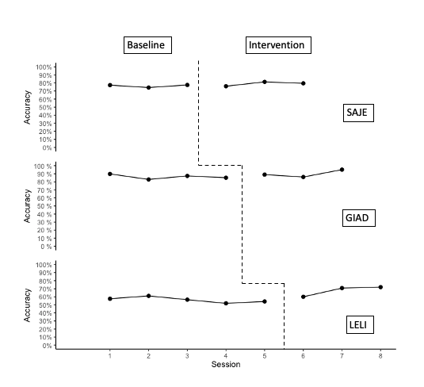
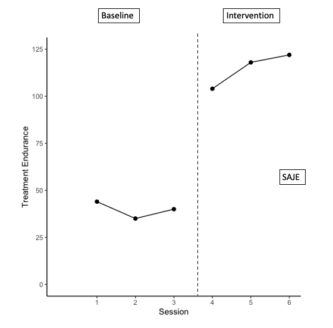
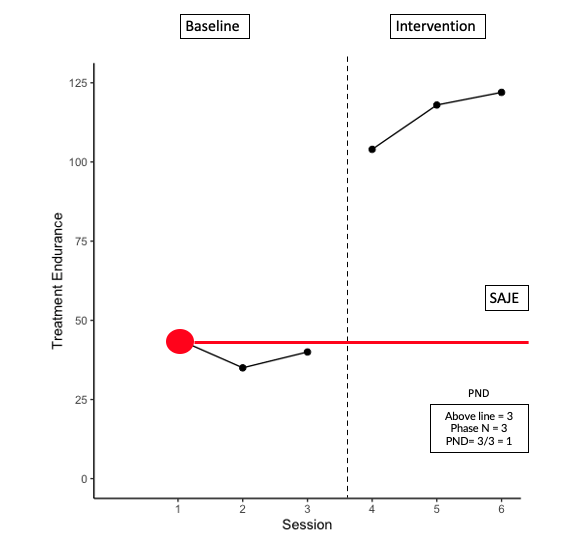
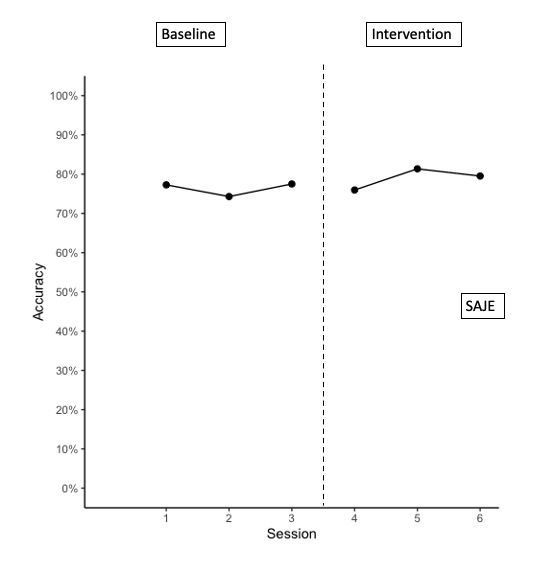
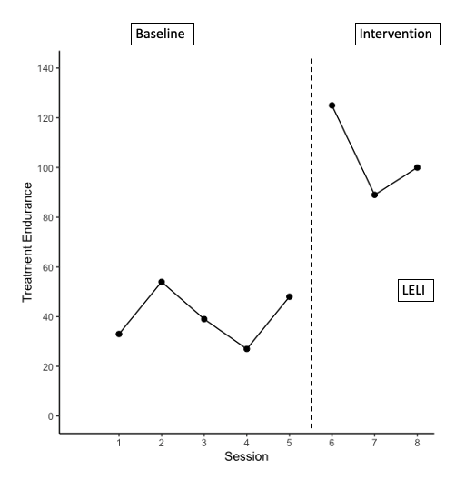
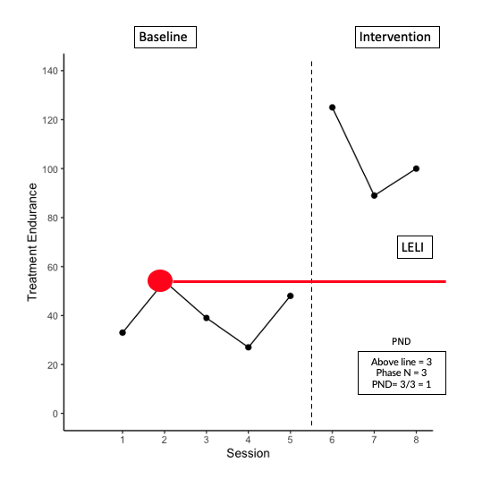
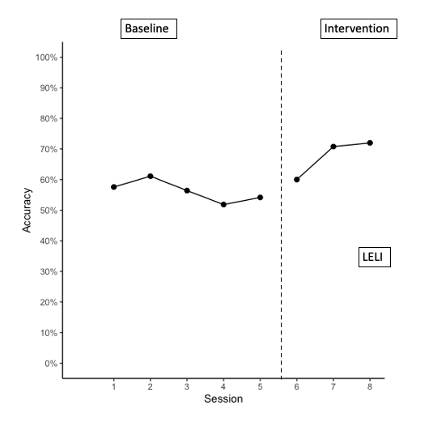
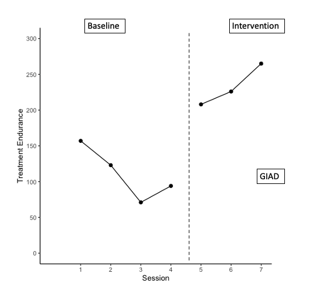
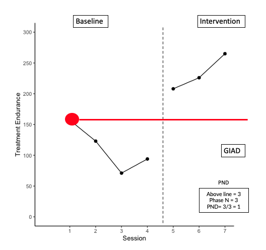
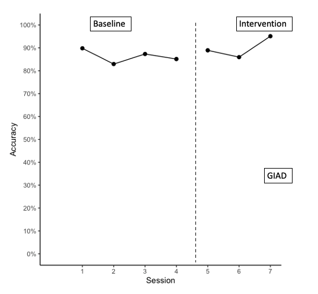

```{r setup, include=FALSE}
knitr::opts_chunk$set(echo = FALSE, warning = FALSE, message = FALSE)
```

```{r setup 1, include=FALSE}
library(tidyverse)
library(rio)
library(here)
library(gghighlight)
library(forcats)
library(ggrepel)
library(gt)
library(knitr)
library(kableExtra)
library(reactable)
library(plotly)
library(SCVA)
library(patchwork)
library(colorblindr)
library(scan)

theme_set(theme_minimal(15) +
            theme(legend.position = "bottom",
                  panel.grid.major.x = element_line(color = "gray60"),
                  panel.grid.minor.x = element_blank(),
                  panel.grid.major.y = element_blank())
          )

saje <- import(here("data", "SAJE_status_goal.xlsx"),
               setclass = "tbl_df") 

giad <- import(here("data", "GIAD_status_goal.xlsx"),
               setclass = "tbl_df") 

leli <- import(here("data", "LELI_status_goal.xlsx"),
               setclass = "tbl_df") 
 
```


## Visual Analysis with Patchwork Code - MBL 


```{r, include=FALSE}
head(saje)

saje_plot <- ggplot() +
  geom_line(data = saje, aes(x = session, y = bl_acc)) +
  geom_point(data = saje, aes(x = session, y = bl_acc), size = 2) +
  geom_line(data = saje, aes(x = session, y = tx_acc)) +
  geom_point(data = saje, aes(x = session, y = tx_acc), size = 2) +
  scale_x_continuous(limits = c(0, 8),
                     breaks = c(1, 2, 3, 4, 5, 6, 7, 8)) +
  scale_y_continuous(limits = c(0, 100),
                     breaks = c(0, 10, 20, 30, 40, 50, 60, 70, 80, 90, 100),
                     labels = function(x) paste0(x, "%")) +
  theme_classic() +
  theme(axis.title.x = element_blank(),
        axis.text.x = element_blank(),
        axis.ticks.x = element_blank(),
        axis.line.x = element_blank()) +
  labs(x = "Session",
       y = "Accuracy") 

saje_plot

giad_plot <- ggplot() +
  geom_line(data = giad, aes(x = session, y = bl_acc)) +
  geom_point(data = giad, aes(x = session, y = bl_acc), size = 2) +
  geom_line(data = giad, aes(x = session, y = tx_acc)) +
  geom_point(data = giad, aes(x = session, y = tx_acc), size = 2) +
  scale_x_continuous(limits = c(0, 8),
                     breaks = c(1, 2, 3, 4, 5, 6, 7, 8)) +
  scale_y_continuous(limits = c(0, 100),
                     breaks = c(0, 10, 20, 30, 40, 50, 60, 70, 80, 90, 100),
                     labels = function(x) paste(x, "%")) +
  theme_classic() +
  theme(axis.title.x = element_blank(),
        axis.text.x = element_blank(),
        axis.ticks.x = element_blank(),
        axis.line.x = element_blank()) +
  labs(x = "Session",
       y = "Accuracy") 

giad_plot

leli_plot <- ggplot() +
  geom_line(data = leli, aes(x = session, y = bl_acc)) +
  geom_point(data = leli, aes(x = session, y = bl_acc), size = 2) +
  geom_line(data = leli, aes(x = session, y = tx_acc)) +
  geom_point(data = leli, aes(x = session, y = tx_acc), size = 2) +
  scale_x_continuous(limits = c(0, 8),
                     breaks = c(1, 2, 3, 4, 5, 6, 7, 8)) +
  scale_y_continuous(limits = c(0, 100),
                     breaks = c(0, 10, 20, 30, 40, 50, 60, 70, 80, 90, 100),
                     labels = function(x) paste0(x, "%")) +
  theme_classic() +
  labs(x = "Session",
       y = "Accuracy") 

leli_plot

all_plots <- saje_plot / giad_plot / leli_plot
all_plots
```

```{r, include=TRUE, fig.height=9, fig.width=10}
all_plots
```


## Visual Analysis with PowerPoint Lines Added - MBL

{width=100%}


## AB Visual Analysis 

### SAJE Endurance

```{r, include=FALSE}
saje_end <- ggplot() +
  geom_line(data = saje, aes(x = session, y = bl_end)) +
  geom_point(data = saje, aes(x = session, y = bl_end), size = 2) +
  geom_line(data = saje, aes(x = session, y = tx_end)) +
  geom_point(data = saje, aes(x = session, y = tx_end), size = 2) +
  scale_x_continuous(limits = c(0, 6),
                     breaks = c(1, 2, 3, 4, 5, 6)) +
  scale_y_continuous(limits = c(0, 125),
                     breaks = c(0, 25, 50, 75, 100, 125)) +
  theme_classic() +
  labs(x = "Session",
       y = "Treatment Endurance") 
```

{width=100%}
### SAJE PND

{width=100%}

### SAJE Accuracy 

```{r, include=FALSE}
saje_acc <- ggplot() +
  geom_line(data = saje, aes(x = session, y = bl_acc)) +
  geom_point(data = saje, aes(x = session, y = bl_acc), size = 2) +
  geom_line(data = saje, aes(x = session, y = tx_acc)) +
  geom_point(data = saje, aes(x = session, y = tx_acc), size = 2) +
  scale_x_continuous(limits = c(0, 6),
                     breaks = c(1, 2, 3, 4, 5, 6)) +
  scale_y_continuous(limits = c(0, 100),
                     breaks = c(0, 10, 20, 30, 40, 50, 60, 70, 80, 90, 100),
                     labels = function(x) paste0(x, "%")) +
  theme_classic() +
  labs(x = "Session",
       y = "Accuracy") 
```


{width=100%}


### LELI Endurance

```{r, include=FALSE}
leli_end <- ggplot() +
  geom_line(data = leli, aes(x = session, y = bl_end)) +
  geom_point(data = leli, aes(x = session, y = bl_end), size = 2) +
  geom_line(data = leli, aes(x = session, y = tx_end)) +
  geom_point(data = leli, aes(x = session, y = tx_end), size = 2) +
  scale_x_continuous(limits = c(0, 8),
                     breaks = c(1, 2, 3, 4, 5, 6, 7, 8)) +
  scale_y_continuous(limits = c(0, 140),
                     breaks = c(0, 20, 40, 60, 80, 100, 120, 140)) +
  theme_classic() +
  labs(x = "Session",
       y = "Treatment Endurance") 
```

{width=100%}

### LELI PND

{width=100%}

### LELI Accuracy 

```{r, include=FALSE}
leli_acc <- ggplot() +
  geom_line(data = leli, aes(x = session, y = bl_acc)) +
  geom_point(data = leli, aes(x = session, y = bl_acc), size = 2) +
  geom_line(data = leli, aes(x = session, y = tx_acc)) +
  geom_point(data = leli, aes(x = session, y = tx_acc), size = 2) +
  scale_x_continuous(limits = c(0, 8),
                     breaks = c(1, 2, 3, 4, 5, 6, 7, 8)) +
  scale_y_continuous(limits = c(0, 100),
                     breaks = c(0, 10, 20, 30, 40, 50, 60, 70, 80, 90, 100),
                     labels = function(x) paste0(x, "%")) +
  theme_classic() +
  labs(x = "Session",
       y = "Accuracy") 
```


{width=100%}


### GIAD Endurance

```{r, include=FALSE}
giad_end <- ggplot() +
  geom_line(data = giad, aes(x = session, y = bl_end)) +
  geom_point(data = giad, aes(x = session, y = bl_end), size = 2) +
  geom_line(data = giad, aes(x = session, y = tx_end)) +
  geom_point(data = giad, aes(x = session, y = tx_end), size = 2) +
  scale_x_continuous(limits = c(0, 7),
                     breaks = c(1, 2, 3, 4, 5, 6, 7)) +
  scale_y_continuous(limits = c(0, 300),
                     breaks = c(0, 50, 100, 150, 200, 250, 300)) +
  theme_classic() +
  labs(x = "Session",
       y = "Treatment Endurance") 
```


{width=100%}
### GIAD PND

{width=100%}

### GIAD Accuracy 

```{r, include=FALSE}
giad_acc <- ggplot() +
  geom_line(data = giad, aes(x = session, y = bl_acc)) +
  geom_point(data = giad, aes(x = session, y = bl_acc), size = 2) +
  geom_line(data = giad, aes(x = session, y = tx_acc)) +
  geom_point(data = giad, aes(x = session, y = tx_acc), size = 2) +
  scale_x_continuous(limits = c(0, 7),
                     breaks = c(1, 2, 3, 4, 5, 6, 7)) +
  scale_y_continuous(limits = c(0, 100),
                     breaks = c(0, 10, 20, 30, 40, 50, 60, 70, 80, 90, 100),
                     labels = function(x) paste0(x, "%")) +
  theme_classic() +
  labs(x = "Session",
       y = "Accuracy") 
```


{width=100%}