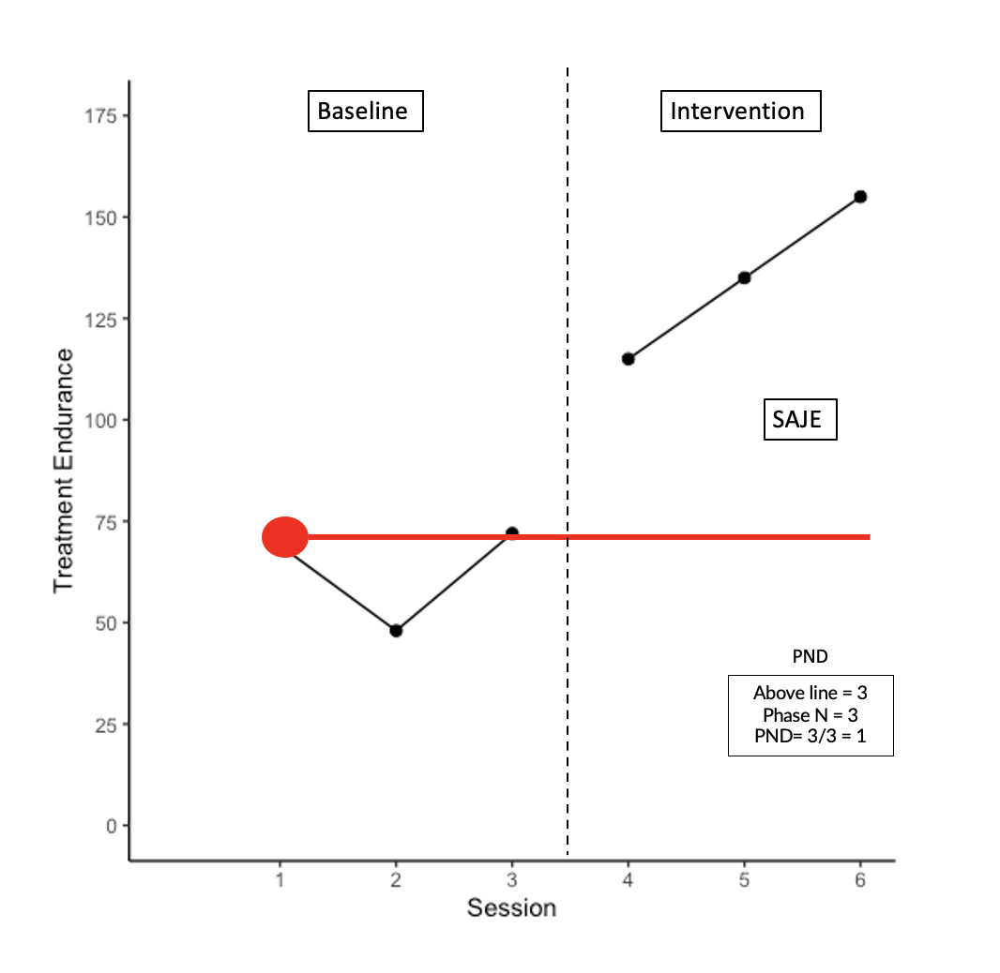
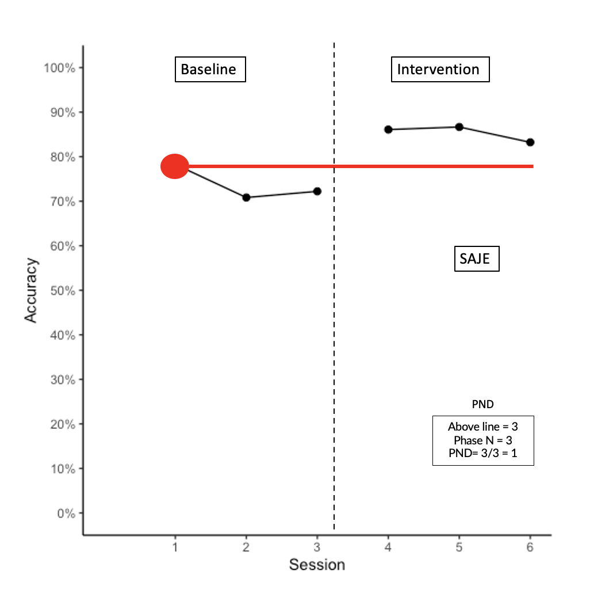
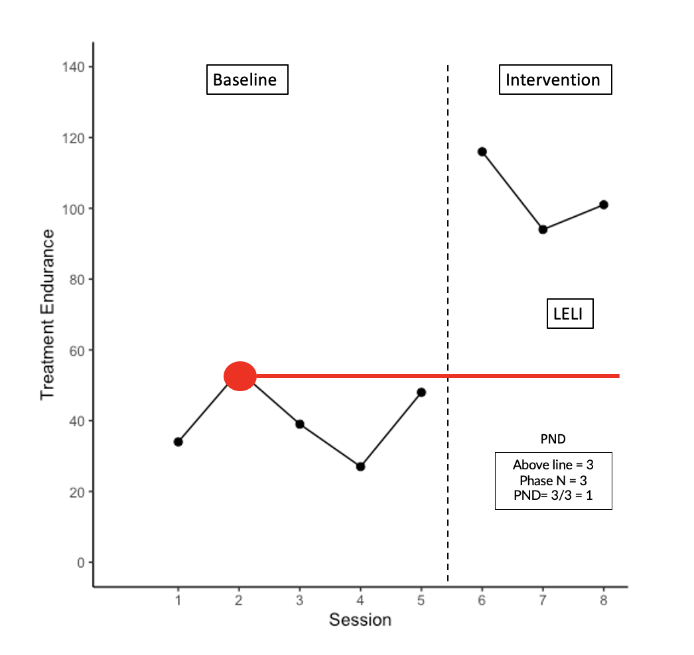
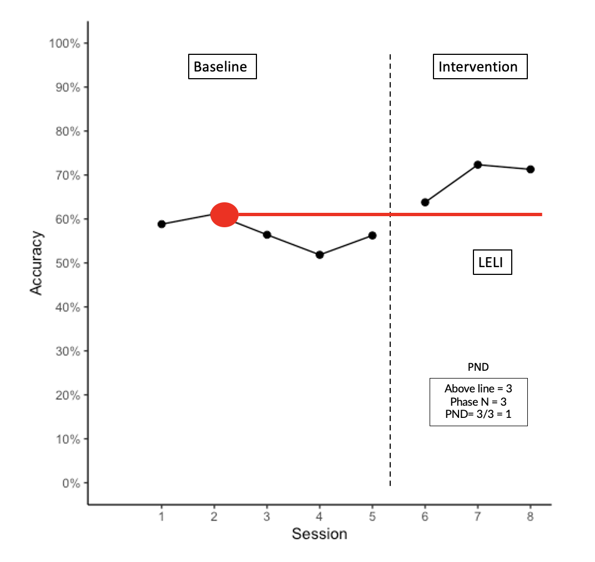
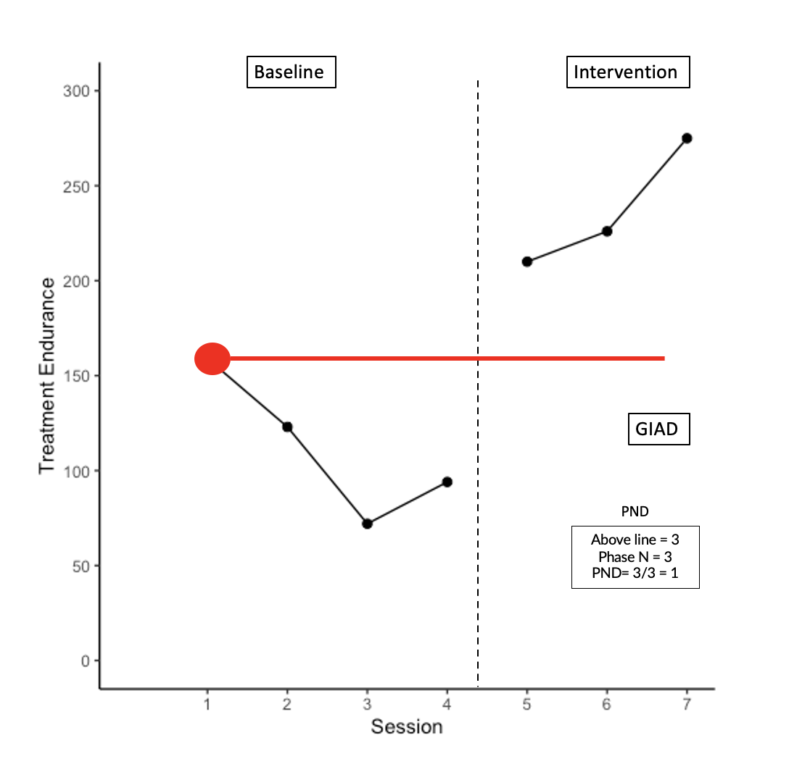
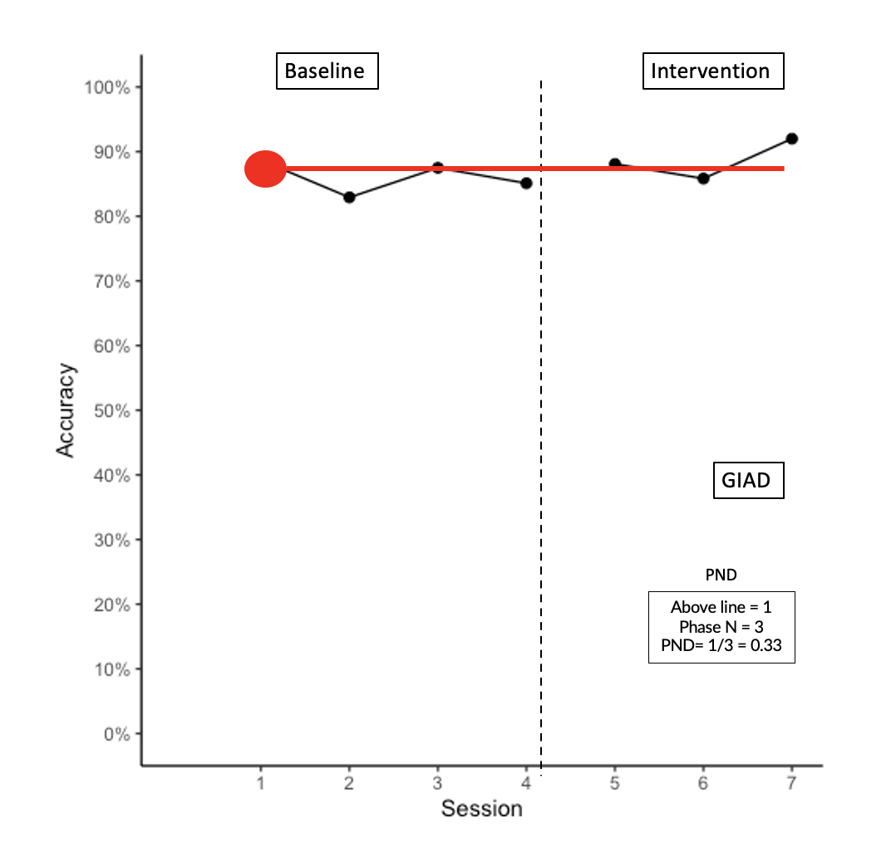
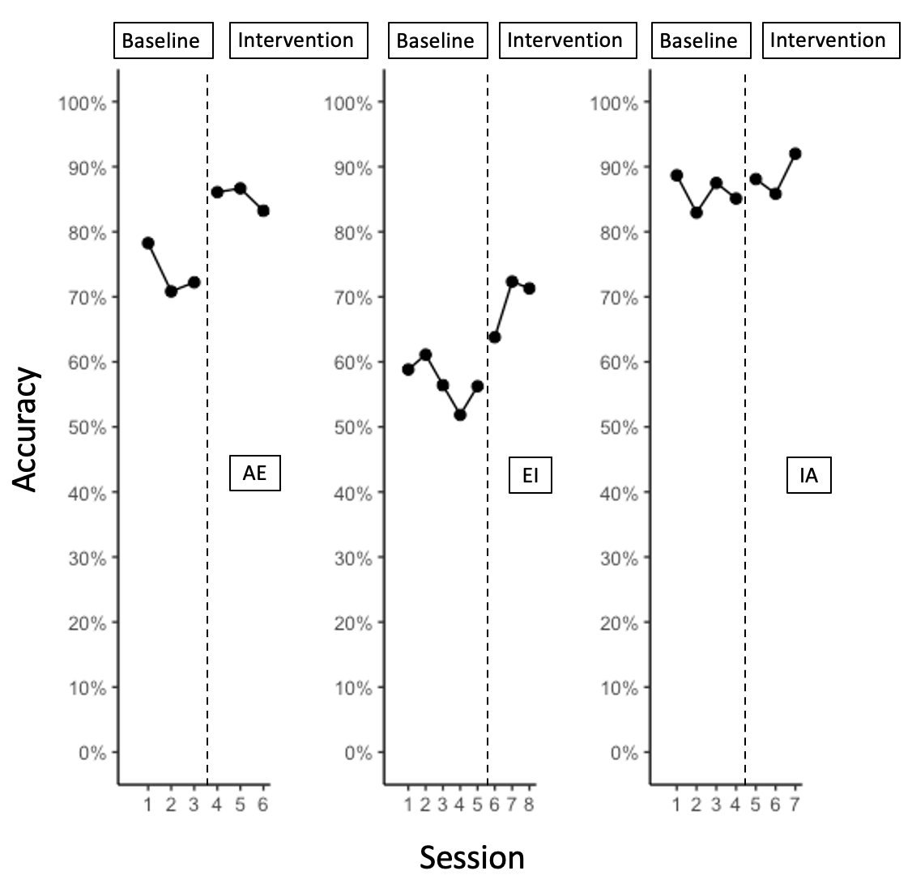
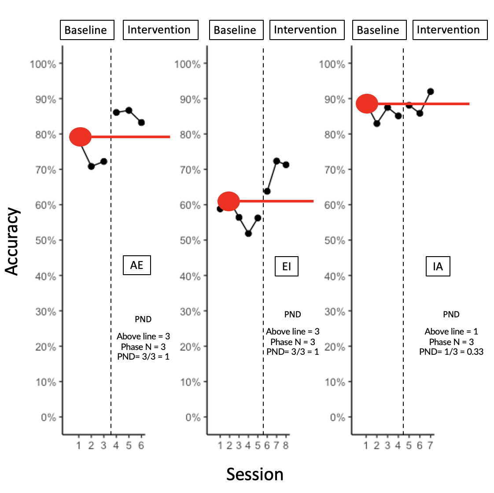

```{r setup, include=FALSE}
knitr::opts_chunk$set(echo = FALSE, warning = FALSE, message = FALSE)
```

```{r setup 1, include=FALSE}
library(tidyverse)
library(rio)
library(here)
library(gghighlight)
library(forcats)
library(ggrepel)
library(gt)
library(knitr)
library(kableExtra)
library(reactable)
library(plotly)
library(SCVA)
library(patchwork)
library(colorblindr)
library(scan)

theme_set(theme_minimal(15) +
            theme(legend.position = "bottom",
                  panel.grid.major.x = element_line(color = "gray60"),
                  panel.grid.minor.x = element_blank(),
                  panel.grid.major.y = element_blank())
          )

saje <- import(here("data", "SAJE_status_goal.xlsx"),
               setclass = "tbl_df") 

giad <- import(here("data", "GIAD_status_goal.xlsx"),
               setclass = "tbl_df") 

leli <- import(here("data", "LELI_status_goal.xlsx"),
               setclass = "tbl_df") 

par_acc <- import(here("data", "all_accuracy.xlsx"),
               setclass = "tbl_df") 
 
par_acc2 <- import(here("data", "all_accuracy_2.xlsx"),
               setclass = "tbl_df") 
```


## AB Visual Analysis 

### SAJE Endurance with PND

```{r, include=FALSE}
saje_end <- ggplot() +
  geom_line(data = saje, aes(x = session, y = bl_end)) +
  geom_point(data = saje, aes(x = session, y = bl_end), size = 2) +
  geom_line(data = saje, aes(x = session, y = tx_end)) +
  geom_point(data = saje, aes(x = session, y = tx_end), size = 2) +
  scale_x_continuous(limits = c(0, 6),
                     breaks = c(1, 2, 3, 4, 5, 6)) +
  scale_y_continuous(limits = c(0, 175),
                     breaks = c(0, 25, 50, 75, 100, 125, 150, 175)) +
  theme_classic() +
  labs(x = "Session",
       y = "Treatment Endurance") 
```

{width=66%}


### SAJE Accuracy with PND

```{r, include=FALSE}
saje_acc <- ggplot() +
  geom_line(data = saje, aes(x = session, y = bl_acc)) +
  geom_point(data = saje, aes(x = session, y = bl_acc), size = 2) +
  geom_line(data = saje, aes(x = session, y = tx_acc)) +
  geom_point(data = saje, aes(x = session, y = tx_acc), size = 2) +
  scale_x_continuous(limits = c(0, 6),
                     breaks = c(1, 2, 3, 4, 5, 6)) +
  scale_y_continuous(limits = c(0, 100),
                     breaks = c(0, 10, 20, 30, 40, 50, 60, 70, 80, 90, 100),
                     labels = function(x) paste0(x, "%")) +
  theme_classic() +
  labs(x = "Session",
       y = "Accuracy") 
```


{width=66%}


### LELI Endurance with PND

```{r, include=FALSE}
leli_end <- ggplot() +
  geom_line(data = leli, aes(x = session, y = bl_end)) +
  geom_point(data = leli, aes(x = session, y = bl_end), size = 2) +
  geom_line(data = leli, aes(x = session, y = tx_end)) +
  geom_point(data = leli, aes(x = session, y = tx_end), size = 2) +
  scale_x_continuous(limits = c(0, 8),
                     breaks = c(1, 2, 3, 4, 5, 6, 7, 8)) +
  scale_y_continuous(limits = c(0, 140),
                     breaks = c(0, 20, 40, 60, 80, 100, 120, 140)) +
  theme_classic() +
  labs(x = "Session",
       y = "Treatment Endurance") 
```

{width=66%}

### LELI Accuracy with PND

```{r, include=FALSE}
leli_acc <- ggplot() +
  geom_line(data = leli, aes(x = session, y = bl_acc)) +
  geom_point(data = leli, aes(x = session, y = bl_acc), size = 2) +
  geom_line(data = leli, aes(x = session, y = tx_acc)) +
  geom_point(data = leli, aes(x = session, y = tx_acc), size = 2) +
  scale_x_continuous(limits = c(0, 8),
                     breaks = c(1, 2, 3, 4, 5, 6, 7, 8)) +
  scale_y_continuous(limits = c(0, 100),
                     breaks = c(0, 10, 20, 30, 40, 50, 60, 70, 80, 90, 100),
                     labels = function(x) paste0(x, "%")) +
  theme_classic() +
  labs(x = "Session",
       y = "Accuracy") 
```


{width=66%}


### GIAD Endurance with PND

```{r, include=FALSE}
giad_end <- ggplot() +
  geom_line(data = giad, aes(x = session, y = bl_end)) +
  geom_point(data = giad, aes(x = session, y = bl_end), size = 2) +
  geom_line(data = giad, aes(x = session, y = tx_end)) +
  geom_point(data = giad, aes(x = session, y = tx_end), size = 2) +
  scale_x_continuous(limits = c(0, 7),
                     breaks = c(1, 2, 3, 4, 5, 6, 7)) +
  scale_y_continuous(limits = c(0, 300),
                     breaks = c(0, 50, 100, 150, 200, 250, 300)) +
  theme_classic() +
  labs(x = "Session",
       y = "Treatment Endurance") 
```


{width=66%}

### GIAD Accuracy with PND

```{r, include=FALSE}
giad_acc <- ggplot() +
  geom_line(data = giad, aes(x = session, y = bl_acc)) +
  geom_point(data = giad, aes(x = session, y = bl_acc), size = 2) +
  geom_line(data = giad, aes(x = session, y = tx_acc)) +
  geom_point(data = giad, aes(x = session, y = tx_acc), size = 2) +
  scale_x_continuous(limits = c(0, 7),
                     breaks = c(1, 2, 3, 4, 5, 6, 7)) +
  scale_y_continuous(limits = c(0, 100),
                     breaks = c(0, 10, 20, 30, 40, 50, 60, 70, 80, 90, 100),
                     labels = function(x) paste0(x, "%")) +
  theme_classic() +
  labs(x = "Session",
       y = "Accuracy") 
```


{width=66%}


## Combined Accuracy Plots 

```{r, include=FALSE}
saje_acc2 <- ggplot() +
  geom_line(data = saje, aes(x = session, y = bl_acc)) +
  geom_point(data = saje, aes(x = session, y = bl_acc), size = 2) +
  geom_line(data = saje, aes(x = session, y = tx_acc)) +
  geom_point(data = saje, aes(x = session, y = tx_acc), size = 2) +
  scale_x_continuous(limits = c(0, 6),
                     breaks = c(1, 2, 3, 4, 5, 6)) +
  scale_y_continuous(limits = c(0, 100),
                     breaks = c(0, 10, 20, 30, 40, 50, 60, 70, 80, 90, 100),
                     labels = function(x) paste0(x, "%")) +
  theme_classic() +
  labs(x = "",
       y = "") 

leli_acc2 <- ggplot() +
  geom_line(data = leli, aes(x = session, y = bl_acc)) +
  geom_point(data = leli, aes(x = session, y = bl_acc), size = 2) +
  geom_line(data = leli, aes(x = session, y = tx_acc)) +
  geom_point(data = leli, aes(x = session, y = tx_acc), size = 2) +
  scale_x_continuous(limits = c(0, 8),
                     breaks = c(1, 2, 3, 4, 5, 6, 7, 8)) +
  scale_y_continuous(limits = c(0, 100),
                     breaks = c(0, 10, 20, 30, 40, 50, 60, 70, 80, 90, 100),
                     labels = function(x) paste0(x, "%")) +
  theme_classic() +
  labs(x = "",
       y = "") 

giad_acc2 <- ggplot() +
  geom_line(data = giad, aes(x = session, y = bl_acc)) +
  geom_point(data = giad, aes(x = session, y = bl_acc), size = 2) +
  geom_line(data = giad, aes(x = session, y = tx_acc)) +
  geom_point(data = giad, aes(x = session, y = tx_acc), size = 2) +
  scale_x_continuous(limits = c(0, 7),
                     breaks = c(1, 2, 3, 4, 5, 6, 7)) +
  scale_y_continuous(limits = c(0, 100),
                     breaks = c(0, 10, 20, 30, 40, 50, 60, 70, 80, 90, 100),
                     labels = function(x) paste0(x, "%")) +
  theme_classic() +
  labs(x = "",
       y = "") 
```

```{r, include=FALSE}
all_acc <- saje_acc2 + leli_acc2 + giad_acc2
```

### Accuracy Presented Horizontally 

{width=75%}

### Accuracy Presented Horizontally with PND

{width=75%}


### Data on Same Plot 

```{r, include=FALSE}
head(par_acc)

par_acc_long <- par_acc %>% 
  pivot_longer(
    cols = c(2:7),
    names_to = "participant_phase",
    values_to = "accuracy"
  )

combined_acc_plot1 <- ggplot(par_acc_long, aes(session, accuracy, 
                                               group = participant_phase)) +
  geom_point(aes(shape = participant_phase), size = 3) +
  geom_line() +
  scale_x_continuous(limits = c(0, 8),
                     breaks = c(1, 2, 3, 4, 5, 6, 7, 8)) +
  scale_y_continuous(limits = c(0, 100),
                     breaks = c(0, 10, 20, 30, 40, 50, 60, 70, 80, 90, 100),
                     labels = function(x) paste0(x, "%")) +
  theme_classic() +
  labs(x = "Session",
       y = "Accuracy",
       shape = "Participant Phase") +
  scale_shape_discrete(name = "Participant Phase",
                      labels = c("GIAD BL",
                                 "GIAD INT",
                                 "LELI BL",
                                 "LELI INT",
                                 "SAJE BL",
                                 "SAJE INT"))
```

#### Version 1

```{r, include=TRUE}
combined_acc_plot1
```


#### Version 2

```{r, include=FALSE}
head(par_acc2)

par_acc2_long <- par_acc2 %>% 
    pivot_longer(
    cols = c(2:4),
    names_to = "participant",
    values_to = "accuracy"
  )

combined_acc_plot2 <- ggplot(par_acc2_long, aes(session, accuracy, 
                                               group = participant)) +
  geom_point(aes(shape = participant), size = 3) +
  geom_line() +
  scale_x_continuous(limits = c(0, 8),
                     breaks = c(1, 2, 3, 4, 5, 6, 7, 8)) +
  scale_y_continuous(limits = c(0, 100),
                     breaks = c(0, 10, 20, 30, 40, 50, 60, 70, 80, 90, 100),
                     labels = function(x) paste0(x, "%")) +
  theme_classic() +
  labs(x = "Session",
       y = "Accuracy",
       shape = "Participant") +
  scale_fill_discrete(name = "Participant")
```

```{r, include=TRUE}
combined_acc_plot2
```

